# SUK AUTH VALIDATION
## Sign Up/Sign In

### Key Points:
- GUI experience
- Strict Validation by Regular Expressions/Regex.
- Password Hashing for extra Security.
- SMTP for Sending Mail.
- CURD operations

### Dependencies
- `Python 3 or newer` -> Python Programming Language, version 3 or newer
- `tkinter` -> It is for GUI, `pip install tk`
- `requests` -> It is for **get**, **post**, **put** and **delete** operations via *Sheety ENDPOINT*, `pip install requests`
- `bcrypt` -> For the Hashing of the Password, `pip install bcrypt`

#### Setup steps:
1. Install Python 3.
2. Install dependencies.
3. Create a blank folder
4. Put all given files in this repository (README.md is not necessary) to new created folder.
5. Change SMTP server, SMTP port(*make sure that your port code should be for SSL*), SMTP service email and password constant in `main.py` according to you.
6. Change Sheety End Point in `main.py`. visit [Sheety](https://sheety.co/).
6. Open **cmd** or **terminal** in the same folder.
7. type `python main.py`, then script will start running

# Program Flow
First screen that appear is `Start Page`, that ask for **Sign Up/Sign In** operation:

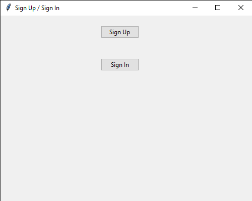

<h1 id="sign-up">Sign Up</h1>

When we click on **Sign Up**, this screen appear.

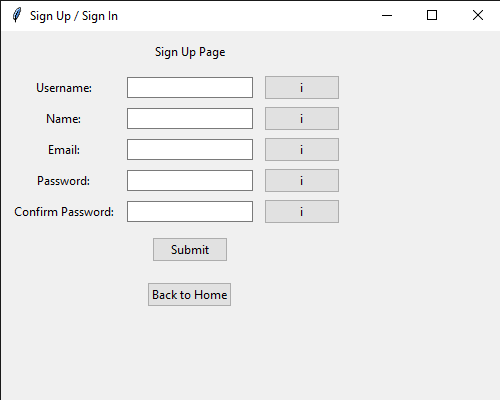

All `i` buttons contain requirment of their attribute to pass this page. When user click on it a message box appear. `i` buttons video:

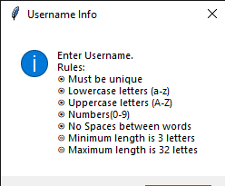
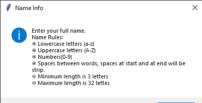
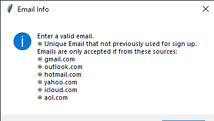
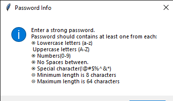

**Without Status (before Submit):**

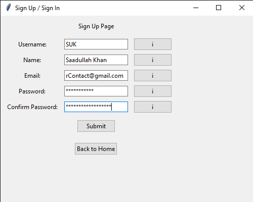

*Make sure to give email that can accept emails for 6-digit code.*

If User input didn't match the `Regular Expressions`, then status of each input will show so user easily identify where are problems.

**Example 1:**

**Example 2:**

**Example 3:**

When user pass the `Regular Expressions`, a `Code Page` appear, see below:

<h2 id="code-page-sign-up">Code Page</h2>

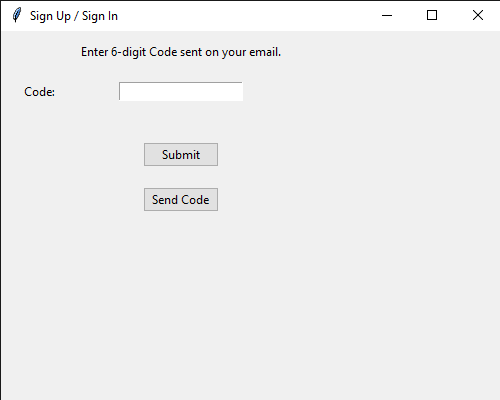

When user click on `Send Code`, it send code to **user email** with subject `SUK - Verification Code` and it turns into `Resent Code`.

<video src="./example-images/CodePage/send-code-to-resent-code.mp4" height=300 controls></video>

Code received on email.

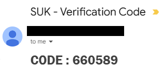

But when user enter the wrong code:

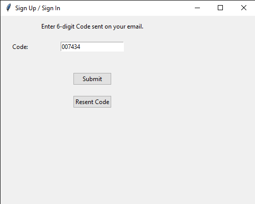

Then, click on `Submit`, if code is wrong it shows wrong status like:

When user input right code, it will redirect to `Home`.

<h2 id="home-page-entry">Home</h2>

> Note: May be you need to click on *Reload* button to see the data you fill.

*Watch below video:*

<video src="./example-images/HOME/reload-btn.mp4" height=300 controls></video>

> Now, You are registered!!, Later again you will [Sign In](#sign-in) to access your account.

See data in google sheet with _Hashed Password_:

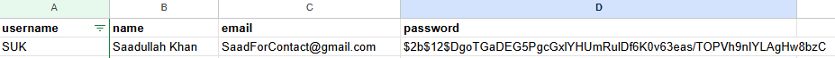

--- 

<h1 id="sign-in">Sign In</h1>

After registratio, You can go in **Sign In** from `Start Page`, then this screen appears.

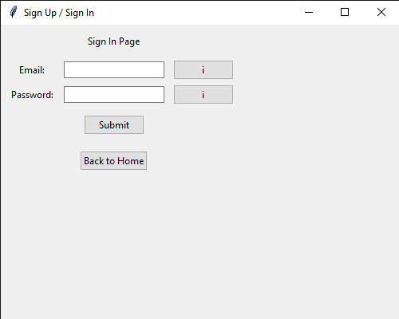

When User input credentials, if they are wrong it will show status otherwise move towards `Code Page` to complete **Sign In** process.

**User input:**

**Example 1:**

**Example 2:**

When user fill right credential, it wil redirect to code Page. See below:

<video src="./example-images/SIGN-IN/sign-in-right-inputs.mp4" height=300 controls></video>

> Note: Code Page process is exact same as in Sign Up process, see [Code Page](#code-page-sign-up)

After completing **Sing In** process. User redirect to Home, again same as in Sign Up process, see [Home](#home-page-entry)

---

<h2>Delete Account</h2>

We can also delete the account, see below video:

<video src="./example-images/DELETE/Delete-the-account.mp4" height=300 controls></video>

---

<h2>Update Info</h2>

*Note: I am facing some internal problems form Sheety or somethings else. In this repo you can find update code but I can't able to test it. I will fix it soon!*

---
## [Saadullah Khan.](https://www.linkedin.com/in/Saadullahkhan3)
